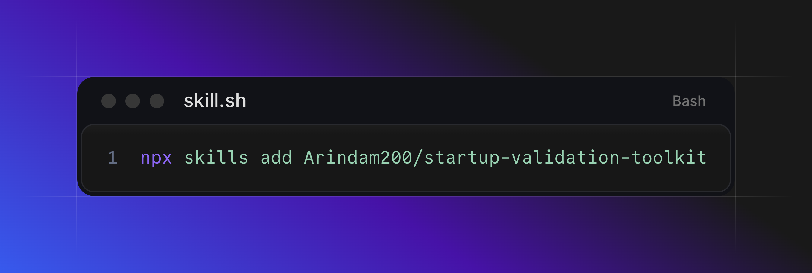

# Startup Validation Toolkit



Three Claude Code skills that turn a one-line startup idea into an evidence-backed decision, a
competitive intelligence report, and an actual launch plan, all sourced from live web data through
the [ScrapingDog](https://dub.sh/scrapingdog) MCP server instead of an LLM's training-data guesses.

Every claim in every report traces back to a URL someone can click. Nothing is estimated or
paraphrased from memory.

## The pipeline

```text
1. startup-idea-validator   "Should I build this?"
        │                    → 0-100 score, go/no-go verdict, real competitors & pain points
        ▼
2. competitor-teardown      "Who am I actually up against?"
        │                    → per-competitor momentum score (hiring, funding, reviews, reach)
        ▼
3. gtm-launch-planner       "How do I sell it?"
                             → positioning, channels, pricing, first-customers plan
```

Each skill works standalone: you can jump straight to a competitor teardown or a GTM plan without
running the validator first, but they're designed to hand off: the validator surfaces competitor
names, the teardown finds the gaps, and the planner turns those gaps into positioning.

## Why this isn't just "web search with extra steps"

A plain search-and-scrape skill can tell you who ranks on Google for a keyword. It can't tell you:

- **Who's hiring for this problem right now** (`google_jobs`): a budget-line-item signal search
  volume alone can't show, and a real source for evidence-based buyer personas.
- **What ChatGPT and Google's AI Mode already recommend** when someone asks "what's the best tool for
  X" (`chatgpt`, `google_ai_mode`, `google_ai_overview`): a live discovery channel that's actively
  growing, and one almost no research process checks.
- **How a competitor's actual customers rate them**, not their homepage testimonials
  (`amazon_reviews`, marketplace/review-site scraping, `youtube_comments`).
- **Whether a competitor is actually growing or has gone quiet**: hiring velocity, funding/press
  recency, and social reach, turned into one comparable momentum score instead of a vibe.

These three skills lean on the ScrapingDog MCP server's full ~30-tool surface: search engines
(Google/Bing/Baidu), Trends/News/Jobs/Patents/Scholar, three e-commerce marketplaces
(Amazon/eBay/Walmart) plus Google Shopping, LinkedIn, X, YouTube (search/video/channel/comments/
transcripts), Google Maps, screenshots, and a tool that queries ChatGPT directly, routed by what the
question actually needs, not used for the sake of using them.

## Install

### Option A: skills.sh (recommended)

Install any or all three skills with the [skills](https://www.skills.sh) CLI; it'll prompt you to
pick which ones you want:

```bash
npx skills add Arindam200/startup-validation-toolkit
```

Or grab a single skill directly:

```bash
npx skills add Arindam200/startup-validation-toolkit/skills/startup-idea-validator
```

### Option B: manual symlink

Copy or symlink the three skill folders into `~/.claude/skills/`:

```bash
ln -s "$(pwd)/skills/startup-idea-validator" ~/.claude/skills/startup-idea-validator
ln -s "$(pwd)/skills/competitor-teardown" ~/.claude/skills/competitor-teardown
ln -s "$(pwd)/skills/gtm-launch-planner" ~/.claude/skills/gtm-launch-planner
```

Either way, you'll still need the ScrapingDog MCP server configured wherever you invoke these
skills; see Setup below.

## Setup

1. Get a ScrapingDog API key at [ScrapingDog](https://dub.sh/scrapingdog).
2. Copy `.env.example` to `.env` in this repo's root and fill in your key:

   ```bash
   cp .env.example .env
   ```

3. Open this folder in Claude Code. The root `.mcp.json` starts the ScrapingDog MCP server
   automatically (via `npx -y scrapingdog-mcp`), sourcing the key from `.env`.
4. Approve the project MCP server when Claude Code prompts on first run.

If you installed via skills.sh or the manual symlink above instead of working in this repo directly,
you'll need the same ScrapingDog MCP server configured globally or in your own project's `.mcp.json`.

## The tool ScrapingDog isn't just search

Each skill's `references/scrapingdog-tools.md` documents exactly which tool answers which research
question, with the full 30-tool catalog and argument reference living in
`startup-idea-validator/references/scrapingdog-tools.md`. Skim that file if you want the complete
picture of what's available before diving into any one skill.

## Skills

| Skill | What it produces | Deterministic scoring |
| --- | --- | --- |
| [`startup-idea-validator`](./skills/startup-idea-validator) | 0-100 validation score, go/no-go verdict, shareable report | `scripts/score_idea.py`: 5 weighted dimensions |
| [`competitor-teardown`](./skills/competitor-teardown) | Per-competitor deep dive + momentum scorecard | `scripts/momentum_score.py`: 5 weighted dimensions |
| [`gtm-launch-planner`](./skills/gtm-launch-planner) | Positioning, channel plan, pricing, first-customers plan | none: a ranked plan, not a single score |

## License

MIT. See [LICENSE](./LICENSE) for details.
